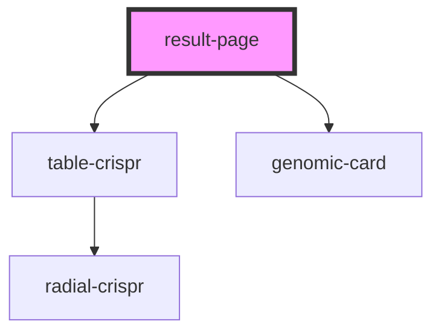

# table-crispr

<!-- Auto Generated Below -->

## Properties

| Property        | Attribute       | Description | Type     | Default     |
| --------------- | --------------- | ----------- | -------- | ----------- |
| `all_data`      | `all_data`      |             | `string` | `undefined` |
| `complete_data` | `complete_data` |             | `string` | `undefined` |

## Dependencies

### Depends on

- table-crispr
- genomic-card

### Graph

----------------------------------------------

*Built with [StencilJS](https://stenciljs.com/)*
